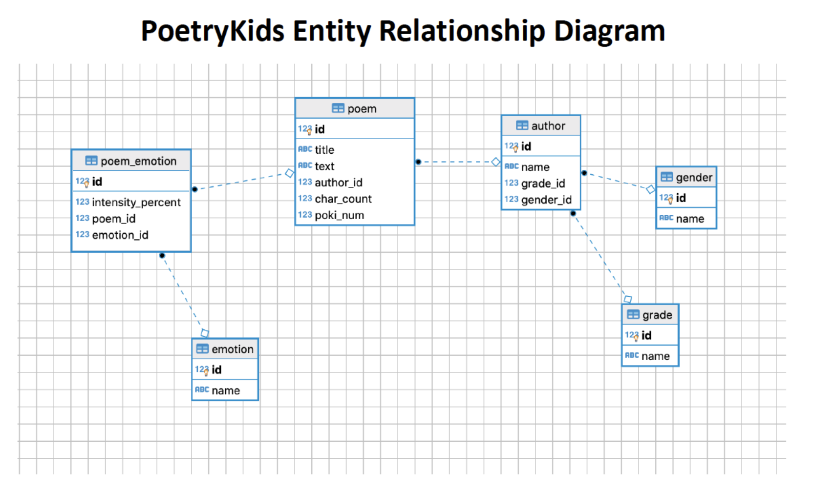
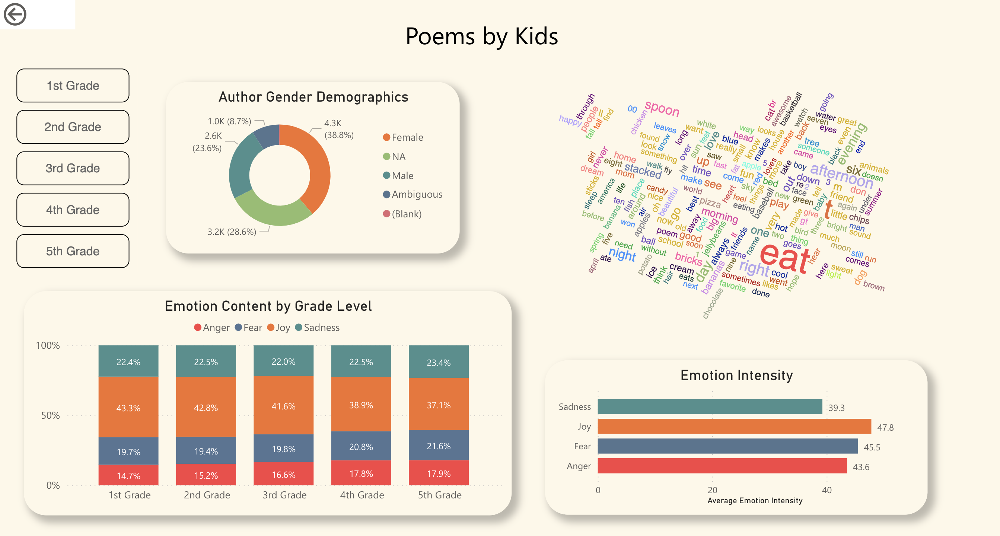

## Poems by Kids

> **Note:** The data in this exercise is derived from the datasets found [here](https://github.com/whipson/PoKi-Poems-by-Kids). An academic paper describing the PoKi project can be found [here](https://arxiv.org/abs/2004.06188)
> The data is used for education purposes with permission from the maintainer.  
> 
### ERD

 
 

## Table of Contents
* [General Information](#general-information)
* [Technologies](#technologies)
* [Files in this Repository](#files)
* [Analysis](#analysis)
* [Dashboard](#dashboard)
 
 

## General Information

 
 
## Technologies
Project is created with:
* Excel

## Files in this Repository
Analysis and findings can all be found in the marathon 
 

## Analysis

 

## Dashboard
https://app.powerbi.com/view?r=eyJrIjoiZDAwZjMyNDktYWU4Ny00NTlhLWE2MWQtMzI4NDY0ZDExOGZjIiwidCI6IjEwMWRhNTg3LTE4NDMtNGY1Mi04YjhhLTE3YjA2OWM2NmQzMyIsImMiOjJ9

